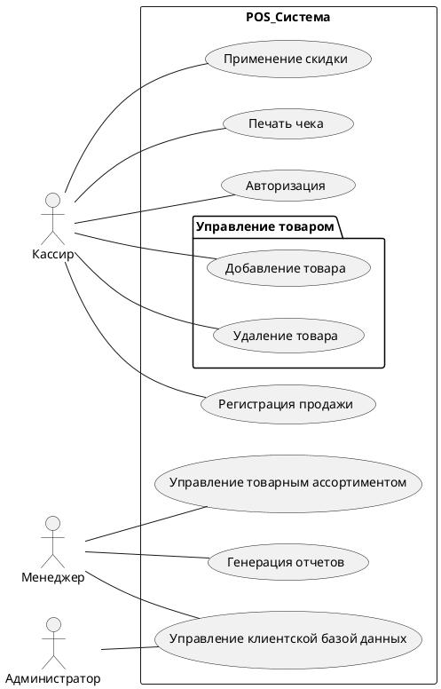
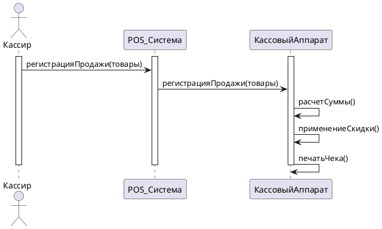

# ЧТЗ на разработку POS-системы

## Введение
Целью данного проекта является разработка **POS-системы** для автоматизации торговли. Эта система будет включать в себя кассовый аппарат, который будет соответствовать требованиям законодательства и обеспечивать эффективную работу торговых точек.

## Термины и определения
|Термин/Аббревиатура| Расшифровка|
|---|---|
|POS-система|Комплект кассового оборудования или [программно-аппаратный комплекс](https://dic.academic.ru/dic.nsf/ruwiki/166710) для расчётов с покупателями |
|Штрих-код товара|Зашифрованные данные, помещённые на поверхность изделия. Информация зашифрована в виде чёрных полос, имеющих разную ширину. Каждый шифр имеет свой уникальный номер|

## Функциональные требования
1. *Регистрация и обработка продаж*:
   - Возможность сканирования штрих-кодов товаров.
   - Расчет суммы покупки и применение скидок покупателя.
   - Печать чека с информацией о товарах и сумме покупки.
2. *Управление товарным ассортиментом*:
   - Возможность добавления, удаления и изменения товаров.
   - Отображение информации о наличии товара на складе.
3. *Управление клиентской базой данных*:
   - Регистрация новых клиентов.
   - Возможность просмотра и редактирования информации о клиентах.
4. *Отчетность*:
   - Генерация отчетов о продажах, прибыли и налогах.
   - Возможность экспорта отчетов в различные форматы (например, Excel).

   ## Диаграмма Use Case

## Нефункциональные требования
1. Безопасность:
   - Защита данных клиентов и транзакций.
   - Возможность авторизации пользователей с различными уровнями доступа.
2. Надежность:
   - Гарантированная работоспособность системы в течение длительного времени.
   - Возможность восстановления данных в случае сбоя.
3. Производительность:
   - Быстрая обработка продаж и генерация отчетов.
4. Удобство использования:
   - Интуитивно понятный интерфейс пользователя.
   - Возможность настройки системы под требования конкретной торговой точки.

## Диаграмма Последовательности

## План работ
1. Изучение требований и анализ существующих POS-систем.
2. Проектирование архитектуры системы и создание диаграмм.
3. Разработка базовой функциональности POS-системы.
4. Тестирование и отладка системы.
5. Доработка и оптимизация системы.
6. Создание документации и обучение
7. Внедрение системы в торговые точки.
7. Подготовка системы к внедрению.
8. Тестирование системы перед внедрением.
9. Внедрение системы в торговые точки.
10. Проведение обучения пользователей.
11. Поддержка и сопровождение системы после внедрения.

